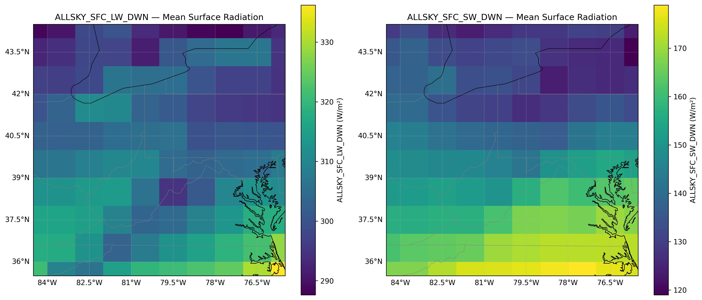

# POWER_ARD_NASA_PY

## NASA POWER Radiation Visualization

This project slices NASA POWER data and produces regional mean surface radiation maps
(Longwave & Shortwave). The image below shows the averaged data for the defined
bounding box (35°N–45°N, 85°W–75°W).

